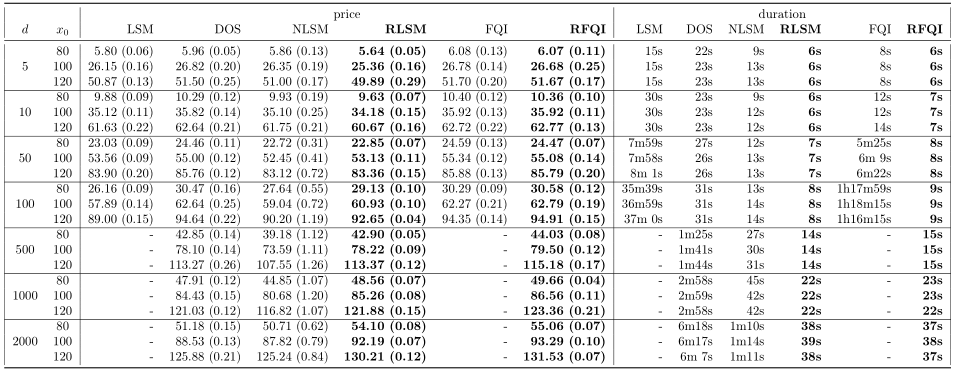
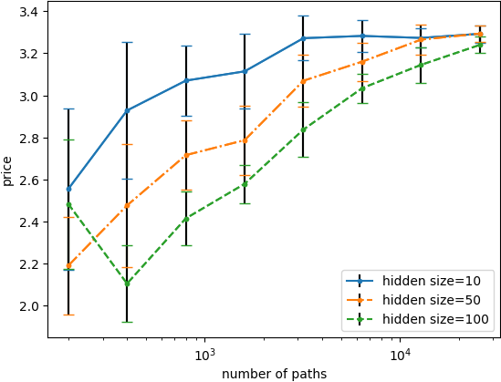
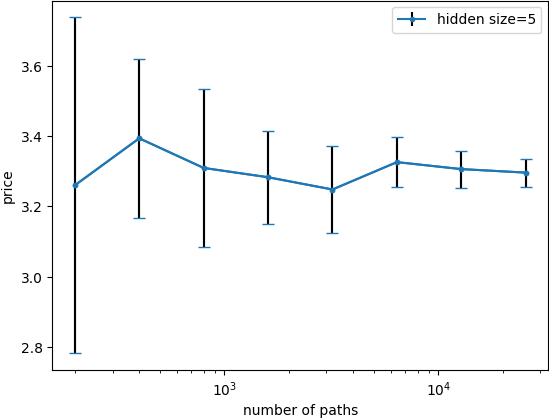
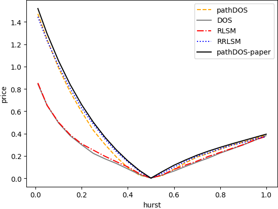
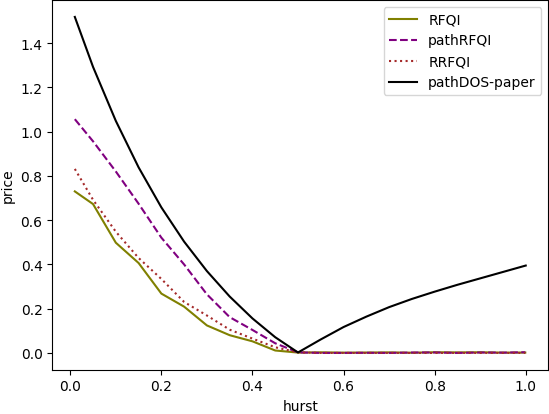
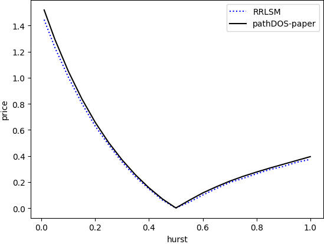

# Optimal Stopping via Randomized Neural Networks
This repository is the official implementation of the paper
[Optimal Stopping via Randomized Neural Networks](https://arxiv.org/abs/2104.13669).

## Installation

Clone this git repo and cd into it.
```sh
git clone https://github.com/HeKrRuTe/OptStopRandNN.git
cd OptStopRandNN
```
Then create a new environment
and install all dependencies and this repo.
* with [conda](https://docs.conda.io/projects/conda/en/latest/user-guide/install/index.html):
 ```sh
 conda create --name OptStopRandNN python=3.7
 conda activate OptStopRandNN
 pip install --no-cache-dir -e .
 ```
* with virtualenv, use equivalent command for non debian based systems.
```sh
sudo apt-get install python3-venv
python3 -m venv py3
source py3/bin/activate
pip3.7 install -e .
```

That's all!

## List of the algorithms available in Optimal Stopping Library

* Backward Induction
  * LSM: Least Square Monte Carlo. [(Longstaff and Schwartz, 2001)](https://people.math.ethz.ch/~hjfurrer/teaching/LongstaffSchwartzAmericanOptionsLeastSquareMonteCarlo.pdf)
  * NLSM: Neural Least Square Monte Carlo. [(Lapeyre  and Lelong, 2019)](https://arxiv.org/abs/1907.06474) [(Becker, Cheridito and Jentzen, 2019)](https://arxiv.org/abs/1912.11060)
  * DOS: Deep Optimal Stopping. [(Becker, Cheridito and Jentzen, 2019)](https://www.jmlr.org/papers/volume20/18-232/18-232.pdf)
  * RLSM: Randomized Least Square Monte Carlo. [(Herrera, Krach, Ruyssen and Teichmann 2021)](https://arxiv.org/abs/2104.13669)
  * RRLSM: Randomized Recurrent Least Square Monte Carlo. [(Herrera, Krach, Ruyssen and Teichmann 2021)](https://arxiv.org/abs/2104.13669)
* Reinforcement Learning
  * FQI: fitted Q-Iteration. [(Tsitsiklis and Van Roy, 2001)](https://www.mit.edu/~jnt/Papers/J086-01-bvr-options.pdf) [(Li, Szepesvari and Schuurmans, 2009)](http://proceedings.mlr.press/v5/li09d/li09d.pdf)
  * LSPI: least-squares policy iteration. [(Li, Szepesvari and Schuurmans, 2009)](http://proceedings.mlr.press/v5/li09d/li09d.pdf)
  * RFQI: randomized fitted Q-Iteration. [(Herrera, Krach, Ruyssen and Teichmann 2021)](https://arxiv.org/abs/2104.13669)


## Running the algorithms

First cd into "OptStopRandNN". Then activate the virtual environmant:
* with conda
```sh
conda activate OptStopRandNN
```
* with virtualenv
```sh
source py3/bin/activate
```


### Some usage info
Specify number of parallel jobs (i.e. CPUs that are used parallelly to run
multiple algorithms) by replacing N by the wanted number of CPUs. By default, it
uses all but one available CPUs.

```sh
python optimal_stopping/run/run_algo.py --nb_jobs=N --configs=...
```

Generate tables directly:

```sh
python optimal_stopping/run/run_algo.py --generate_pdf=True --configs=...
```

Write comparison tables and figures used in PDF:

```sh
python optimal_stopping/run/write_figures.py --configs=single_test_maxcall_10stocks
```

Profiling performances:

```sh
python3 -m cProfile optimal_stopping/run/run_algo.py   --algo=longstaffSchwartz   --stock_model=BlackScholes   --strike
=100   --volatility=0.3   --spot=100   --rate=0.02   --dividend=0.0   --maturity=1   --nb_stocks=1   
--nb_paths=1000   --nb_steps=100   --payoff=MaxPut   --output_dir=output                             
```

### The Markovian Case
<p align="center" width="100%">
    
</p>
Max call option on Black Scholes for different number of stocks d and varying initial stock price x0. RLSM achieves the highest prices while being the fastest and having considerably less trainable parameters.


Generate the tables of the paper:
```sh
python optimal_stopping/run/run_algo.py --configs=table_spots_Dim_BS_MaxCall --nb_jobs=10;
python optimal_stopping/run/run_algo.py --configs=table_Dim_Heston_MaxCall --nb_jobs=10;
python optimal_stopping/run/run_algo.py --configs=table_spots_Dim_BS_MaxCall_bf --nb_jobs=10;
python optimal_stopping/run/run_algo.py --configs=table_Dim_Heston_MaxCall_bf --nb_jobs=10;  
python optimal_stopping/run/run_algo.py --configs=table_spots_Dim_BS_MaxCall_do --nb_jobs=10;
python optimal_stopping/run/run_algo.py --configs=table_Dim_Heston_MaxCall_do --nb_jobs=10;
python optimal_stopping/run/write_figures.py --configs=table_spots_Dim_BS_MaxCall_gt;
python optimal_stopping/run/write_figures.py --configs=table_Dim_Heston_MaxCall_gt;

python optimal_stopping/run/run_algo.py --configs=table_smallDim_BS_GeoPut --nb_jobs=10;
python optimal_stopping/run/run_algo.py --configs=table_Dim_BS_BasktCall --nb_jobs=10;
python optimal_stopping/run/run_algo.py --configs=table_Dim_BS_BasktCall_bf --nb_jobs=10;
python optimal_stopping/run/write_figures.py --configs=table_other_payoffs_gt;

python optimal_stopping/run/run_algo.py --configs=table_manyDates_BS_MaxCall1 --nb_jobs=10;
python optimal_stopping/run/run_algo.py --configs=table_manyDates_BS_MaxCall2 --nb_jobs=5;
python optimal_stopping/run/write_figures.py --configs=table_manyDates_BS_MaxCall_gt;
```

### Empirical Convergence studies:

<p align="center" width="100%">
    
    
</p>
Mean and standard deviation (bars) of the price for a max-call on 5 stocks following for the Heston model (down) for RLSM (right) and RFQI (left) for varying the number of paths and varying for RLSM the number of neurones in the hidden layer.

Generate convergence studies of the paper:

```sh
python optimal_stopping/run/run_algo.py --configs=table_conv_study_Heston_LND --nb_jobs=80 --generate_pdf;
python optimal_stopping/run/run_algo.py --configs=table_conv_study_BS_LND --nb_jobs=80 --generate_pdf;
python optimal_stopping/run/run_algo.py --configs=table_conv_study_Heston_FQIR --nb_jobs=80 --generate_pdf;
python optimal_stopping/run/run_algo.py --configs=table_conv_study_BS_FQIR --nb_jobs=80 --generate_pdf;
```


### The Non-Markovian Case: a fractional Bronian Motion
<p align="center" width="100%">
    
    
    
</p>
Left: algorithms processing  path information outperform. Middle: reinforcement learning algorithms do not work well in non-Markovian case. Right: RRLSM achieves similar results as reported in [(Becker, Cheridito and Jentzen, 2019)](https://arxiv.org/abs/1912.11060), while using only 20K paths instead of 4M for training wich took only 4s instead of the reported 430s.

**Generate the hurst plot of paper:**
```sh
python optimal_stopping/run/run_algo.py --configs=table_RNN_DOS --nb_jobs=10;
python optimal_stopping/run/run_algo.py --configs=table_RNN_DOS_PD --nb_jobs=10;
python optimal_stopping/run/run_algo.py --configs=table_RNN_DOS_bf --nb_jobs=10;
python optimal_stopping/run/run_algo.py --configs=table_RNN_DOS_randRNN --nb_jobs=10;
python optimal_stopping/run/run_algo.py --configs=table_RNN_DOS_FQIR_PD --nb_jobs=10;
python optimal_stopping/run/run_algo.py --configs=table_RNN_DOS_FQIRRNN --nb_jobs=10;
python amc2/plot_hurst.py;
```

**Generate the hurst table of paper:**
```sh
python optimal_stopping/run/run_algo.py --configs=table_highdim_hurst0 --nb_jobs=10;
python optimal_stopping/run/run_algo.py --configs=table_highdim_hurst_PD0 --nb_jobs=10;
python optimal_stopping/run/run_algo.py --configs=table_highdim_hurst_RNN0 --nb_jobs=10;
python optimal_stopping/run/run_algo.py --configs=table_highdim_hurst --nb_jobs=10;
python optimal_stopping/run/run_algo.py --configs=table_highdim_hurst_PD --nb_jobs=10;
python optimal_stopping/run/run_algo.py --configs=table_highdim_hurst_RNN --nb_jobs=10;
python optimal_stopping/run/write_figures.py --configs=table_highdim_hurst_gt;
```

### Generate the Ridge Regression Tests:
```sh
python optimal_stopping/run/run_algo.py --configs=table_Ridge_MaxCall --nb_jobs=10;
python optimal_stopping/run/write_figures.py --configs=table_Ridge_MaxCall;
```

### Generate the other basis functions Tests:
```sh
python optimal_stopping/run/run_algo.py --configs=table_OtherBasis_MaxCall --nb_jobs=10;
python optimal_stopping/run/write_figures.py --configs=table_OtherBasis_MaxCall;
```


## License

This code can be used in accordance with the LICENSE.

Citation
--------

If you use this library for your publications, please cite our paper:
[Optimal Stopping via Randomized Neural Networks](https://arxiv.org/abs/2104.13669).
```
@article{OptStopRandNN2021,
author    = {Herrera, Calypso and Krach, Florian and Ruyssen, Pierre and Teichmann, Josef },
title     = {Optimal Stopping via Randomized Neural Networks},
journal   = {CoRR},
volume    = {abs/2104.13669},
year      = {2021},
url       = {https://arxiv.org/abs/2104.13669}}
```

Last Page Update: **29/04/2021**
